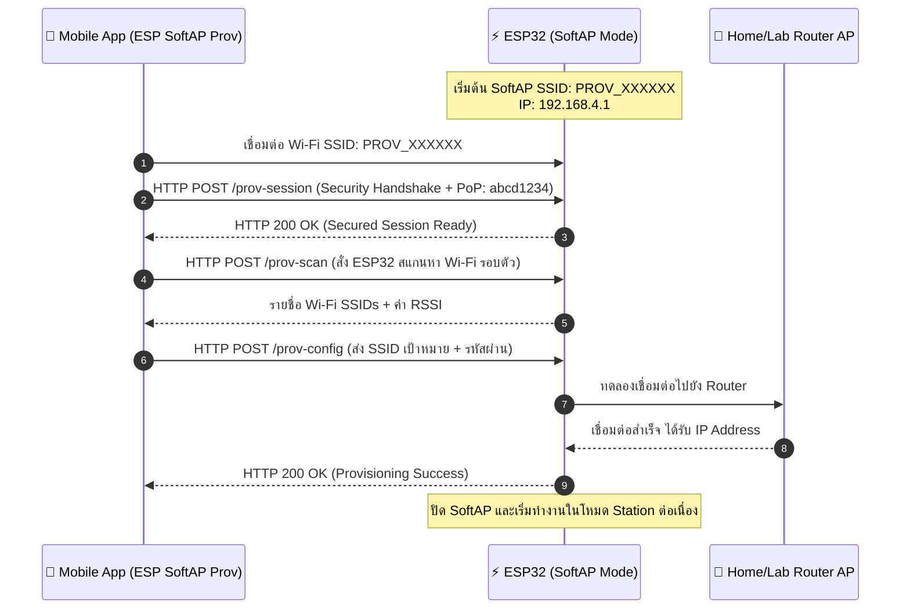

# ใบงานที่ 7.2 การคอนฟิก Wi-Fi ผ่าน SoftAP Scheme และการวิเคราะห์ Protocomm Endpoints

## 0. กล่าวนำ (Introduction)
ในใบงานนี้ นักศึกษาจะได้ทดลองตั้งค่าเครือข่าย Wi-Fi ให้กับ ESP32 ผ่านช่องทาง **Wi-Fi SoftAP Scheme (`wifi_prov_scheme_softap`)** โดยใช้สมาร์ตโฟนเชื่อมต่อเข้ากับเครือข่ายจำลองที่ ESP32 สร้างขึ้น 

นักศึกษาจะได้เรียนรู้โครงสร้างของ QR Code Payload, การทำงานของ Protocomm ผ่านโปรโตคอล HTTP REST-like Endpoints (`/prov-session`, `/prov-config`), และการส่งข้อมูลการตั้งค่า Wi-Fi จากแอปพลิเคชันมือถือ **ESP SoftAP Provisioning**

---

## 1. วัตถุประสงค์ (Objectives)
1. สามารถคอนฟิกตัวอย่าง `wifi_prov_mgr` ให้ทำงานในโหมด **SoftAP Transport Scheme**
2. สามารถใช้สมาร์ตโฟนเชื่อมต่อและทำ Provisioning ผ่านแอปพลิเคชัน **ESP SoftAP Provisioning** (หรือผ่าน Web Browser QR Code) ได้สำเร็จ
3. สังเกตและวิเคราะห์ Event Sequence Lifecycle ใน Serial Monitor ระหว่างการทำ SoftAP Provisioning
4. เข้าใจการทำงานของ Protocomm Endpoint ในระดับ Application Layer

---

## 2. อุปกรณ์และซอฟต์แวร์ที่ใช้ในการทดลอง
1. บอร์ดไมโครคอนโทรลเลอร์ ESP32 พร้อมสาย USB
2. สมาร์ตโฟน (Android หรือ iOS) ที่ติดตั้งแอปพลิเคชัน **ESP SoftAP Provisioning** (หรือแอปกล้องสแกน QR Code)
3. Wi-Fi Access Point ภายในห้องเรียนหรือ Hotspot จากสมาร์ตโฟนอีกเครื่อง

---

## 3. สถาปัตยกรรมและแผนภาพลำดับเหตุการณ์ (Sequence Diagram)



---

## 4. ขั้นตอนการทดลอง (Step-by-Step Procedures)

### ขั้นตอนที่ 1: การเปิดโปรเจกต์ Lab 7-2
1. เปิด Terminal ในโฟลเดอร์โปรเจกต์ `Week-07-W-iFi-Privisioning/Example_codes/Lab7-2-SoftAP-Provisioning`
2. โค้ดในโปรเจกต์นี้ได้รับการตั้งค่าเป็น **SoftAP Scheme** และ **Security 1 (PoP: `abcd1234`)** ไว้ล่วงหน้าเรียบร้อยแล้ว

---

### ขั้นตอนที่ 2: การ Flash และสังเกต QR Code
1. สั่งล้าง Flash และ Flash โปรแกรม:
   ```powershell
   idf.py -p COM24 erase-flash flash monitor
   ```
2. สังเกต Log ใน Serial Monitor จะปรากฏข้อความและ QR Code:
   ```text
   I (776) wifi_prov_scheme_softap: Starting SoftAP with SSID: PROV_XXXXXX
   I (786) app: Scan this QR code from the provisioning application for Provisioning.
   ... [รูป QR Code แบบ ASCII Text] ...
   I (816) app: If QR code is not visible, copy paste the below URL in a browser.
   https://espressif.github.io/esp-jumpstart/qrcode.html?data={"ver":"v1","name":"PROV_XXXXXX","pop":"abcd1234","transport":"softap"}
   ```

---

### ขั้นตอนที่ 3 ดำเนินการ Provisioning ผ่านสมาร์ตโฟน
1. เปิดแอป **ESP SoftAP Provisioning** บนสมาร์ตโฟน
2. **วิธีที่ A (สแกน QR Code)** แตะปุ่ม "Scan QR Code" แล้วสแกนภาพ QR Code บนหน้าจอ Serial Monitor (หรือเปิดผ่าน URL ที่ได้จาก Log)
3. **วิธีที่ B (เชื่อมต่อ Manual)**
   - ไปที่การตั้งค่า Wi-Fi บนมือถือ เชื่อมต่อ Wi-Fi ชื่อ `PROV_XXXXXX`
   - เปิดแอป กด "Provision" และป้อน PoP เป็น `abcd1234`
4. เมื่อแอปค้นหา ESP32 พบ ให้เลือกชื่อ Wi-Fi ภายในห้องเรียนหรือ Hotspot ที่ต้องการเชื่อมต่อ และป้อนรหัสผ่าน Wi-Fi
5. กดปุ่ม **Provision** และสังเกตแถบสถานะบนแอปจนกระทั่งขึ้น **"Provisioning Successful!"**

---

### ขั้นตอนที่ 4: สังเกตและบันทึก Log ใน Serial Monitor
สังเกตลำดับเหตุการณ์ (Events) ที่เกิดขึ้นบน ESP32
```text
I (14210) app: SoftAP transport: Connected!
I (15320) app: Secured session established!
I (16440) app: Received Wi-Fi credentials
	SSID     : Lab_WiFi_2.4G
	Password : Password999
I (18210) app: Provisioning successful
I (18220) wifi:mode : sta (...)
I (19850) app: Connected with IP Address: 192.168.1.150
```

---

---

## 5. กิจกรรมถอดรหัสซอร์สโค้ดและเขียนผังงาน (Code Deconstruction & Sequence Flow Assignment)

ให้นักศึกษาแกะรอยการทำงานจาก `main/main.c` ในโหมด SoftAP แล้วเขียน **แผนภาพลำดับเหตุการณ์ (Sequence Diagram)**:

### ภารกิจที่ 1: ผังลำดับการสื่อสารผ่าน HTTP Endpoints (SoftAP Scheme Sequence Flow)
ให้นักศึกษาวาด Sequence Diagram แสดงปฏิสัมพันธ์ระหว่าง 3 ฝ่าย:
1. **Smartphone App (ESP SoftAP Prov)**
2. **ESP32 SoftAP Webserver (Protocomm Layer)**
3. **Wi-Fi Router (AP ปลายทาง)**

**จุดที่ต้องระบุในผัง:**
- จังหวะที่มือถือยิง HTTP POST ไปยัง Endpoint แต่ละตัว (`/prov-session`, `/prov-scan`, `/prov-config`)
- Event ของ ESP-IDF ที่ถูก Trigger ใน `event_handler()` เช่น:
  - `WIFI_EVENT_AP_STACONNECTED`
  - `PROTOCOMM_SECURITY_SESSION_SETUP_OK`
  - `WIFI_PROV_CRED_RECV`
  - `WIFI_PROV_CRED_SUCCESS`
  - `IP_EVENT_STA_GOT_IP`
- สถานะจังหวะการกระพริบของ **LED 3 (GPIO 5)** และ **LED 1 (GPIO 2)** ในแต่ละช่วง

```text
[พื้นที่สำหรับแนบรูปภาพ Sequence Diagram ที่นักศึกษาเขียนขึ้นด้วย Draw.io / Mermaid / วาดมือ]
```

---

### 6. ตารางบันทึกผลการทดลอง (Experiment Results)
รายการตรวจสอบ	ค่าที่บันทึกได้จากการทดลอง
1. ชื่อ SoftAP SSID ของ ESP32	PROV_A1B2C3
2. รหัส PoP (Proof of Possession)	abcd1234
3. ข้อความใน QR Code Payload (JSON)	{"ver":"v1","name":"PROV_A1B2C3","pop":"abcd1234","transport":"softap"}
4. พฤติกรรมไฟ LED 3 (GPIO 5) ช่วงรอ vs ช่วงส่งข้อมูล	ช่วงรอ: กระพริบเป็นจังหวะเพื่อแสดงว่ารอ Provisioning
ช่วงส่ง: ยังคงแสดงสถานะ Provisioning จนกว่าจะได้รับข้อมูลและเชื่อมต่อสำเร็จ
5. IP Address ที่ ESP32 ได้รับจาก Router	192.168.1.150
6. เวลาที่ใช้ตั้งแต่เริ่มจนจบกระบวนการ (วินาที)	ประมาณ 20 วินาที
7. คำถามท้ายการทดลอง (Post-Lab Questions)


1. ในโหมด SoftAP Scheme สมาร์ตโฟนส่งข้อมูลหา ESP32 ผ่านโปรโตคอลและ IP Address ใด?

คำตอบ:
สมาร์ตโฟนจะเชื่อมต่อเข้ากับ Wi-Fi SoftAP ที่ ESP32 สร้างขึ้น และส่งข้อมูล Provisioning ผ่าน HTTP ไปยัง Protocomm Web Server ของ ESP32 โดย ESP32 จะใช้ IP Address เริ่มต้นเป็น 192.168.4.1 ในโหมด SoftAP

ดังนั้นการสื่อสารจะมีลักษณะดังนี้:

Smartphone
    ↓
Wi-Fi SoftAP: PROV_A1B2C3
    ↓
HTTP
    ↓
ESP32: 192.168.4.1
    ↓
Protocomm Endpoints
/prov-session
/prov-scan
/prov-config
2. หากผู้ใช้ป้อนรหัสผ่าน Wi-Fi ผิดในแอปมือถือ จะเกิด Event ใดขึ้นบน ESP32 (WIFI_PROV_CRED_FAIL หรือไม่) และ ESP32 มีพฤติกรรมอย่างไร?

คำตอบ:
หากผู้ใช้ป้อนรหัสผ่าน Wi-Fi ผิด ESP32 จะพยายามนำ SSID และ Password ที่ได้รับไปเชื่อมต่อกับ Access Point แต่การ Authentication จะไม่สำเร็จ ทำให้เกิด Event WIFI_PROV_CRED_FAIL ในกระบวนการ Provisioning

โดยทั่วไป ESP32 จะยังคงอยู่ในสถานะ Provisioning เพื่อให้ผู้ใช้สามารถลองส่งข้อมูล Wi-Fi ใหม่ได้อีกครั้ง ขึ้นอยู่กับการตั้งค่าของโปรแกรมและจำนวนครั้งที่อนุญาตให้ลองเชื่อมต่อ

ลำดับโดยย่อ:

/prov-config
     ↓
รับ SSID + Password
     ↓
ESP32 ทดลองเชื่อมต่อ Router
     ↓
Password ผิด
     ↓
WIFI_PROV_CRED_FAIL
     ↓
Provisioning ยังไม่สำเร็จ
     ↓
ผู้ใช้สามารถลองส่งข้อมูลใหม่
3. ทำไมผู้ผลิต IoT ส่วนใหญ่จึงมองว่ากระบวนการเชื่อมต่อแบบ SoftAP มีขั้นตอนที่ยุ่งยากสำหรับผู้ใช้ทั่วไปเมื่อเทียบกับ BLE?

คำตอบ:
เนื่องจาก SoftAP ต้องให้ผู้ใช้เข้าไปที่การตั้งค่า Wi-Fi ของสมาร์ตโฟนก่อน เพื่อเชื่อมต่อกับเครือข่าย SoftAP ที่ ESP32 สร้างขึ้น จากนั้นจึงกลับเข้าแอป Provisioning เพื่อส่งข้อมูล Wi-Fi ให้กับอุปกรณ์ ทำให้มีหลายขั้นตอนและผู้ใช้อาจสับสนได้

ในขณะที่ BLE สามารถให้แอปพลิเคชันค้นหาและสื่อสารกับ ESP32 ผ่าน Bluetooth ได้โดยตรง โดยไม่จำเป็นต้องสลับเครือข่าย Wi-Fi ของโทรศัพท์ ทำให้ประสบการณ์การใช้งานสำหรับผู้ใช้ทั่วไปง่ายกว่า

เปรียบเทียบได้ดังนี้:

SoftAP
มือถือ
  ↓
เข้า Settings
  ↓
เชื่อมต่อ Wi-Fi ของ ESP32
  ↓
กลับเข้าแอป
  ↓
ใส่ PoP / Provisioning
  ↓
ส่ง Wi-Fi SSID + Password
  ↓
ESP32 เชื่อมต่อ Router

BLE
มือถือ
  ↓
เปิดแอป
  ↓
ค้นหา ESP32 ผ่าน BLE
  ↓
ส่ง Wi-Fi SSID + Password
  ↓
ESP32 เชื่อมต่อ Router

ดังนั้น SoftAP มีข้อเสียด้าน User Experience เพราะผู้ใช้ต้องสลับ Wi-Fi Network และมีขั้นตอนมากกว่า BLE แต่ข้อดีคือสามารถใช้การสื่อสารผ่าน Wi-Fi/HTTP ซึ่งเหมาะกับการส่งข้อมูลและการทำงานของอุปกรณ์ที่ต้องการใช้เครือข่าย Wi-Fi โดยตรง

