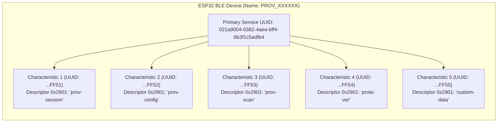

# ใบงานที่ 7.3 การคอนฟิก Wi-Fi ผ่าน BLE Scheme และการสืบสวน GATT Services (BLE Forensics)

## 0. กล่าวนำ (Introduction)
**Bluetooth Low Energy (BLE) Provisioning** เป็นรูปแบบมาตรฐานสากลที่อุปกรณ์ Smart Home ชั้นนำ (เช่น Apple HomeKit, Google Home, Matter Protocol) เลือกใช้ เนื่องจากผู้ใช้ไม่ต้องสลับการเชื่อมต่อ Wi-Fi บนสมาร์ตโฟน 

ในใบงานนี้ นักศึกษาจะได้สลับ ESP32 มาทำงานในโหมด **BLE Scheme (`wifi_prov_scheme_ble`)** พร้อมทั้งใช้เครื่องมือวิเคราะห์เชิงลึก **nRF Connect for Mobile** เพื่อส่องดูโครงสร้างภายในของ **GATT Primary Services, 128-bit UUIDs, Characteristics และ Descriptors** ก่อนจะทำการ Provisioning ผ่านแอป **ESP BLE Provisioning**

---

## 1. วัตถุประสงค์ (Objectives)
1. สามารถคอนฟิกตัวอย่าง `wifi_prov_mgr` ให้ทำงานในโหมด **BLE Transport Scheme** ได้สำเร็จ
2. สามารถใช้เครื่องมือ **nRF Connect for Mobile** ในการสแกนและตรวจสอบโครงสร้าง GATT Services/Characteristics ของ Protocomm บน ESP32
3. อ่านและวิเคราะห์ Descriptor `0x2901` (User Characteristic Description) เพื่อระบุชื่อ Protocomm Endpoints
4. ดำเนินการ Provisioning ผ่านแอปพลิเคชัน **ESP BLE Provisioning** และสังเกตการคืนหน่วยความจำ Bluetooth RAM (`BTDM memory released`)

---

## 2. อุปกรณ์และซอฟต์แวร์ที่ใช้ในการทดลอง
1. บอร์ดไมโครคอนโทรลเลอร์ ESP32 พร้อมสาย USB
2. สมาร์ตโฟนที่รองรับ BLE และติดตั้งแอปพลิเคชัน:
   - **nRF Connect for Mobile** (โดย Nordic Semiconductor)
   - **ESP BLE Provisioning** (โดย Espressif)
3. Wi-Fi Access Point ภายในห้องเรียนหรือ Hotspot

---

## 3. สถาปัตยกรรม GATT Services & Endpoints บน BLE Scheme



---

## 4. ขั้นตอนการทดลอง (Step-by-Step Procedures)

### ขั้นตอนที่ 1: การเปิดโปรเจกต์ Lab 7-3
1. เปิด Terminal ในโฟลเดอร์โปรเจกต์ `Week-07-W-iFi-Privisioning/Example_codes/Lab7-3-BLE-Provisioning`
2. โค้ดในโปรเจกต์นี้ได้รับการตั้งค่าเปิดใช้งาน **BLE Scheme (NimBLE)** และ **Security 1 (PoP: `abcd1234`)** ไว้เรียบร้อยแล้ว

---

### ขั้นตอนที่ 2: Build, Flash และตรวจสอบสถานะเริ่มต้น
1. สั่งล้าง Flash และ Flash โปรแกรมใหม่:
   ```powershell
   idf.py -p COM24 erase-flash flash monitor
   ```
2. สังเกต Log ใน Serial Monitor:
   ```text
   I (712) wifi_prov_scheme_ble: Starting BLE provisioning
   I (722) app: Starting provisioning
   I (732) app: Scan this QR code from the provisioning application for Provisioning.
   ... [QR Code ASCII & URL] ...
   ```

---

### ขั้นตอนที่ 3: ส่องโครงสร้าง GATT ผ่านแอป nRF Connect (BLE Forensic)
1. เปิดแอป **nRF Connect for Mobile** บนสมาร์ตโฟน
2. แตะปุ่ม **Scan** เพื่อค้นหาอุปกรณ์บลูทูธรอบตัว
3. ค้นหาชื่ออุปกรณ์ที่ขึ้นต้นด้วย `PROV_XXXXXX` (ตรงกับที่ระบุใน Serial Monitor)
4. สังเกตค่า RSSI และแตะปุ่ม **CONNECT** เพื่อเชื่อมต่อ
5. เมื่อเชื่อมต่อสำเร็จ สำรวจดู **GATT Services**:
   - มองหา **Unknown Service** ที่มี Base UUID `021a9004-0382-4aea-bff4-6b3f1c5adfb4`
   - ขยายดูรายการ Characteristics แต่ละตัว
   - สังเกตว่าในแต่ละ Characteristic จะมี Descriptor `Characteristic User Description` (`UUID 0x2901`) แตะดูค่า จะพบชื่อ Endpoint เช่น `"prov-session"`, `"prov-config"`, `"custom-data"`
6. บันทึกภาพหน้าจอและข้อมูล UUIDs ลงในตารางผลการทดลอง
7. กดปุ่ม **DISCONNECT** บนแอป nRF Connect เพื่อปล่อยบอร์ดให้พร้อมรับการ Provision

---

### ขั้นตอนที่ 4: ทำการ Provisioning ด้วยแอป ESP BLE Provisioning
1. เปิดแอป **ESP BLE Provisioning**
2. เลือก "Provision New Device" $\rightarrow$ เลือก "BLE"
3. แตะชื่อบอร์ด `PROV_XXXXXX` (หรือสแกน QR Code)
4. ป้อน PoP เป็น `abcd1234`
5. เลือกเครือข่าย Wi-Fi ในห้องเรียน และป้อนรหัสผ่าน Wi-Fi
6. กด **Provision** และรอจนกระทั่งเชื่อมต่อสำเร็จ

---

### ขั้นตอนที่ 5: สังเกตการปล่อยหน่วยความจำ Bluetooth (Memory Freeing)
สังเกตใน Serial Monitor หลังเชื่อมต่อ Wi-Fi สำเร็จ:
```text
I (24560) app: Provisioning successful
I (24570) wifi_prov_scheme_ble: BT memory released
I (24580) wifi_prov_scheme_ble: BTDM memory released
I (26120) app: Connected with IP Address: 192.168.1.155
```
> **ข้อสังเกต:** บอร์ดจะทำการล้างและคืนหน่วยความจำของ Bluetooth Stack ทั้งหมดคืนสู่ระบบ DRAM ทันที ทำให้ประหยัด RAM ได้มหาศาล!

---

---

## 5. กิจกรรมถอดรหัสซอร์สโค้ดและเขียนผังงาน (Code Deconstruction & BLE GATT Architecture Assignment)

ให้นักศึกษาแกะรอยการทำงานของโมดูล BLE Provisioning ใน `main/main.c` แล้วเขียน **ผังโครงสร้างและลำดับเหตุการณ์**:

### ภารกิจที่ 1: ผังโครงสร้าง GATT Tree & Endpoint Mapping
ให้นักศึกษาวาดโครงสร้างต้นไม้ (Tree Diagram / Block Diagram) แสดงความสัมพันธ์ระหว่าง:
- **Primary Service (128-bit UUID: `021a9004-...`)**
  - **Characteristic UUIDs** แต่ละตัว
  - **Descriptor 0x2901 (User Description)** ที่ผูกเข้ากับ Protocomm Endpoints (`prov-session`, `prov-config`, `prov-scan`, `proto-ver`, `custom-data`)

### ภารกิจที่ 2: ผังลำดับการคืนหน่วยความจำ Bluetooth (BLE Lifecycle & Memory Reclaim Flow)
ให้นักศึกษาวาด Flowchart / Sequence แสดงว่า:
1. การเชื่อมต่อ BLE ถูกตรวจพบผ่าน Event `PROTOCOMM_TRANSPORT_BLE_CONNECTED` (LED 2 กระพริบเร็ว 100ms)
2. เมื่อเชื่อมต่อ Wi-Fi สำเร็จ (`WIFI_PROV_CRED_SUCCESS`) $\rightarrow$ เกิด Event `WIFI_PROV_END`
3. Provisioning Manager สั่งเรียก `esp_bt_mem_release()` เพื่อปล่อย DRAM คืนสู่ระบบอย่างไร

```text
[พื้นที่สำหรับแนบรูปภาพ Diagram ที่นักศึกษาเขียนขึ้นด้วย Draw.io / Mermaid / วาดมือ]
```

---

## 6. ตารางบันทึกผลการทดลอง (Experiment Results)

| รายการตรวจสอบ | ผลการทดลอง / ข้อมูลที่สังเกตได้ |

| :--- | :--- |

| 1. BLE Device Name ที่สแกนเจอ** | `PROV_A1B2C3` |

| 2. Primary Service UUID (128-bit)** | `021a9004-0382-4aea-bff4-6b3f1c5adfb4` |

| 3. Characteristic Endpoint ที่พบ (0x2901)** | 1. `prov-session`<br/>2. `prov-config`<br/>3. `prov-scan` |

| 4. พฤติกรรมไฟ LED 2 (GPIO 4) ช่วงรอ vs ช่วงต่อ BLE** | ช่วงรอ: กระพริบช้าเป็นจังหวะ<br/>ช่วงต่อ: กระพริบเร็วประมาณทุก 100 ms |

| 5. พฤติกรรมเมื่อต่อ Wi-Fi สำเร็จ** | มี Log คืนหน่วยความจำ Bluetooth หรือไม่? มี (BT memory released / BTDM memory released) |

---

## 7. คำถามท้ายการทดลอง (Post-Lab Questions)

1. เหตุใด BLE Provisioning จึงไม่ส่งผลให้สัญญาณ Wi-Fi บนสมาร์ตโฟนของผู้ใช้หลุดระหว่างทำรายการ?

คำตอบ: เนื่องจาก BLE ใช้การสื่อสารผ่าน Bluetooth Low Energy แยกจากการเชื่อมต่อ Wi-Fi ของสมาร์ตโฟน จึงสามารถเชื่อมต่อ BLE กับ ESP32 และใช้งาน Wi-Fi เดิมบนโทรศัพท์ได้พร้อมกัน โดยไม่ต้องสลับเครือข่าย Wi-Fi

2. Descriptor `0x2901` มีความสำคัญอย่างไรต่อการที่แอปพลิเคชันมือถือจะทราบว่า Characteristic แต่ละตัวใช้ทำหน้าที่อะไร?

คำตอบ: Descriptor `0x2901` หรือ Characteristic User Description ใช้เก็บข้อความอธิบายหน้าที่ของ Characteristic แต่ละตัว ทำให้แอปพลิเคชันสามารถระบุได้ว่า Characteristic นั้นเกี่ยวข้องกับ Protocomm Endpoint ใด เช่น `prov-session`, `prov-config` หรือ `prov-scan`

3. การที่ ESP-IDF มีฟังก์ชัน `esp_bt_mem_release()` มีประโยชน์อย่างไรต่อการทำงานของแอปพลิเคชัน IoT หลังเชื่อมต่อ Wi-Fi สำเร็จ?

คำตอบ: หลังจาก Provisioning ผ่าน BLE สำเร็จแล้ว Bluetooth Stack ไม่จำเป็นต้องใช้งานต่อสำหรับการ Provisioning จึงสามารถเรียก `esp_bt_mem_release()` เพื่อคืนหน่วยความจำ Bluetooth ให้ระบบ ทำให้มี RAM เหลือมากขึ้นสำหรับการทำงานอื่นของ ESP32 เช่น Web Server, MQTT, Sensor และระบบควบคุม IoT

