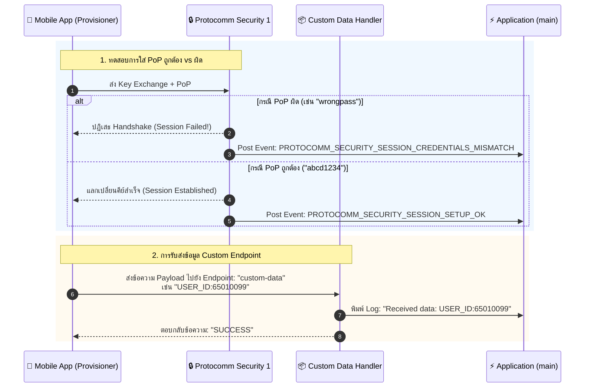
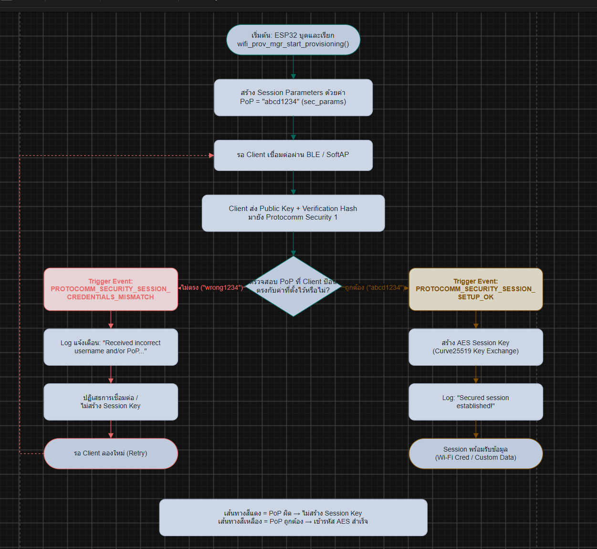

# ใบงานที่ 7.4: การทดสอบ Security Schemes (PoP) และการรับส่ง Custom Data Endpoints

## 0. กล่าวนำ (Introduction)
ในใบงานนี้ นักศึกษาจะได้ทดสอบเจาะลึกด้านความปลอดภัยของกระบวนการ Provisioning โดยทำการทดลองจำลองสถานการณ์ที่มีผู้ไม่หวังดีพยายามเชื่อมต่อด้วย **รหัส Proof-of-Possession (PoP) ที่ไม่ถูกต้อง** เพื่อสังเกตกลไกการปฏิเสธการเชื่อมต่อของ Protocomm Security Layer

นอกจากนี้ นักศึกษาจะได้เรียนรู้การเพิ่ม **Custom Data Endpoint (`custom-data`)** เพื่อรับส่งข้อมูลเฉพาะของแอปพลิเคชัน (เช่น Device ID, Owner Email, MQTT Broker URL หรือ Activation Code) ระหว่างมือถือและ ESP32 ในระหว่างขั้นตอน Provisioning

---

## 1. วัตถุประสงค์ (Objectives)
1. เข้าใจบทบาทและการทำงานของ **Proof-of-Possession (PoP)** ในการป้องกันการโจมตีแบบสวมรอย (Rogue Provisioning)
2. ทดลองจำลองกรณีป้อน PoP ผิด และสังเกต Event `PROTOCOMM_SECURITY_SESSION_CREDENTIALS_MISMATCH`
3. เข้าใจการลงทะเบียน Custom Endpoint ด้วย `wifi_prov_mgr_endpoint_create()` และ `wifi_prov_mgr_endpoint_register()`
4. สังเกตและวิเคราะห์การรับส่งข้อมูลผ่าน Custom Handler (`custom_prov_data_handler`)

---

## 2. อุปกรณ์และซอฟต์แวร์ที่ใช้ในการทดลอง
1. บอร์ดไมโครคอนโทรลเลอร์ ESP32 พร้อมสาย USB
2. สมาร์ตโฟนที่ติดตั้งแอปพลิเคชัน **ESP BLE Provisioning** หรือ **ESP SoftAP Provisioning**
3. Serial Monitor Tool

---

## 3. สถาปัตยกรรม Custom Endpoint & PoP Security Handshake



---

## 4. โค้ดส่วน Custom Data Handler ในตัวอย่าง `main.c`

พิจารณาการทำงานของฟังก์ชันจัดการข้อมูล Custom Endpoint:

```c
/* Handler สำหรับ Custom Endpoint ที่แอปพลิเคชันลงทะเบียนไว้ */
esp_err_t custom_prov_data_handler(uint32_t session_id, const uint8_t *inbuf, ssize_t inlen,
                                   uint8_t **outbuf, ssize_t *outlen, void *priv_data)
{
    if (inbuf) {
        ESP_LOGI(TAG, "Received custom data: %.*s", (int)inlen, (char *)inbuf);
    }
    
    // จัดเตรียมข้อความตอบกลับไปยังสมาร์ตโฟน
    char response[] = "ACK_FROM_ESP32";
    *outbuf = (uint8_t *)strdup(response);
    if (*outbuf == NULL) {
        ESP_LOGE(TAG, "System out of memory");
        return ESP_ERR_NO_MEM;
    }
    *outlen = strlen(response) + 1;

    return ESP_OK;
}
```

และขั้นตอนการลงทะเบียนใน `app_main()`:
```c
// 1. สร้าง Endpoint ก่อนเริ่ม Provisioning Service
wifi_prov_mgr_endpoint_create("custom-data");

// 2. เริ่มต้น Service
ESP_ERROR_CHECK(wifi_prov_mgr_start_provisioning(security, (const void *) sec_params, service_name, service_key));

// 3. ผูกฟังก์ชัน Callback เข้ากับ Endpoint หลังเริ่ม Service แล้ว
wifi_prov_mgr_endpoint_register("custom-data", custom_prov_data_handler, NULL);
```

---

## 5. ขั้นตอนการทดลอง (Step-by-Step Procedures)

### ตอนที่ 1: การเปิดโปรเจกต์และทดสอบ Security Handshake ด้วย PoP
1. เปิด Terminal ในโฟลเดอร์โปรเจกต์ `Week-07-W-iFi-Privisioning/Example_codes/Lab7-4-Custom-Data-and-Security`
2. สั่งล้าง Flash และรันโปรแกรม:
   ```powershell
   idf.py -p COM24 erase-flash flash monitor
   ```
3. เปิดแอป **ESP BLE Provisioning** สแกนหาบอร์ด ESP32
3. **การทดสอบที่ 1 (ป้อน PoP ผิด):**
   - เมื่อแอปถามรหัส PoP ให้พิมพ์รหัสผ่านมั่ว เช่น `wrong1234`
   - สังเกตปฏิกิริยาบนแอปมือถือและใน Serial Monitor:
     ```text
     E (15600) app: Received incorrect username and/or PoP for establishing secure session!
     ```
4. **การทดสอบที่ 2 (ป้อน PoP ถูกต้อง):**
   - สั่งรีเซ็ตบอร์ดใหม่ และเปิดแอปป้อน PoP เป็น `abcd1234` (ตรงกับค่าในโค้ด)
   - สังเกต Log:
     ```text
     I (18200) app: Secured session established!
     ```

---

### ตอนที่ 2: การรับส่งข้อมูลผ่าน Custom Endpoint
1. ในหน้าแอป **ESP BLE Provisioning** หลังผ่านขั้นตอนความปลอดภัยแล้ว ให้เข้าไปที่เมนู **Custom Data** หรือส่งข้อมูลผ่านแอปที่รองรับการเขียน Custom Endpoint
2. ป้อนข้อความ เช่น `STUDENT_ID:65010099` และกดส่ง
3. สังเกต Serial Monitor จะปรากฏข้อความที่ได้รับจากสมาร์ตโฟน:
   ```text
   I (22150) app: Received custom data: STUDENT_ID:65010099
   ```

---

---

## 6. กิจกรรมถอดรหัสซอร์สโค้ดและเขียนผังงาน (Code Deconstruction & Security Flow Assignment)

ให้นักศึกษาแกะรอยการทำงานด้านความปลอดภัยและ Custom Handler ใน `main/main.c` แล้วเขียน **ผังการไหลของข้อมูล (Data Flow & Cryptographic Handshake Flow)**:

### ภารกิจที่ 1: ผังขั้นตอนการตรวจสอบ PoP (Security Handshake Decision Flow)
ให้นักศึกษาวาด Flowchart แสดงการแลกเปลี่ยนคีย์และตรวจสอบสิทธิ์:
1. การสร้าง Session Parameters ด้วยค่า PoP (`abcd1234`)
2. เมื่อ Client ส่ง Public Key + Verification Hash มาให้ ESP32
3. จุดแยกทางเลือก (Branching):
   - หาก PoP ไม่ตรง $\rightarrow$ Trigger Event `PROTOCOMM_SECURITY_SESSION_CREDENTIALS_MISMATCH` และปฏิเสธการเชื่อมต่อ
   - หาก PoP ถูกต้อง $\rightarrow$ Trigger Event `PROTOCOMM_SECURITY_SESSION_SETUP_OK` และสร้าง AES Session Key สำเร็จ

### ภารกิจที่ 2: ผังการรับส่งข้อมูลผ่าน Custom Endpoint (Custom Data Handler Flow)
ให้นักศึกษาวาด Sequence / Data Flow ของฟังก์ชัน `custom_prov_data_handler()`:
1. ข้อมูล `inbuf` ถูกส่งเข้ามาจากสมาร์ตโฟนผ่าน Protocomm
2. การพิมพ์ข้อความ Log ด้วย `ESP_LOGI()`
3. การจัดสรรหน่วยความจำแบบไดนามิกด้วย `strdup()` ให้กับ `*outbuf`
4. ทำไมตัวแปร `*outbuf` จึงต้องจัดสรรใน Heap Memory (ทำไมจึงใช้ตัวแปร Local Static Array ธรรมดาไม่ได้)?

``text
[พื้นที่สำหรับแนบรูปภาพ Diagram ที่นักศึกษาเขียนขึ้นด้วย Draw.io / Mermaid / วาดมือ]

```

---

## 7. ตารางบันทึกผลการทดลอง (Experiment Results)

| สถานการณ์ทดสอบ | ค่า PoP ที่ป้อน | ผลลัพธ์บนแอปมือถือ | ข้อความ Log ใน Serial Monitor |

| :--- | :--- | :--- | :--- |

| 1. ป้อน PoP ผิดพลาด** | `wrong1234` | Provisioning ไม่สำเร็จ / Secure Session ถูกปฏิเสธ | `Received incorrect username and/or PoP for establishing secure session!` |

| 2. ป้อน PoP ถูกต้อง** | `abcd1234` | Provisioning สำเร็จและเข้าสู่ Secure Session | `Secured session established!` |

| 3. ส่ง Custom Data** | `TEST_DATA_999` | ส่งข้อมูลสำเร็จและได้รับ ACK | `Received custom data: TEST_DATA_999` |

---

## 8. คำถามท้ายการทดลอง (Post-Lab Questions)

1. การใช้ **Proof-of-Possession (PoP)** ช่วยป้องกันการโจมตีประเภทใดได้บ้าง?

คำตอบ: PoP ช่วยป้องกันผู้ที่ไม่ได้รับอนุญาตไม่ให้เข้ามาทำ Provisioning กับ ESP32 โดยเฉพาะการพยายามสวมรอยเป็นผู้ใช้งานที่ถูกต้องหรือการเข้าถึงอุปกรณ์โดยผู้โจมตีที่อยู่ในบริเวณใกล้เคียง หากไม่มี PoP ผู้โจมตีอาจพยายามสร้าง Secure Session กับอุปกรณ์ได้ง่ายขึ้น

2. หากไม่มีการใช้ PoP (เช่น ใน Security 0) ผู้โจมตีที่อยู่ในรัศมีสัญญาณบลูทูธสามารถทำสิ่งใดกับอุปกรณ์ได้บ้าง?

คำตอบ: ผู้โจมตีที่อยู่ในระยะสัญญาณ Bluetooth อาจสามารถเชื่อมต่อกับอุปกรณ์และส่งข้อมูล Provisioning ได้โดยไม่ต้องพิสูจน์ว่าตนเป็นผู้ใช้งานที่ได้รับอนุญาต ซึ่งอาจทำให้สามารถตั้งค่า Wi-Fi ใหม่หรือส่งข้อมูลไปยัง Endpoint ที่เปิดใช้งานได้ ส่งผลให้เกิดความเสี่ยงต่อการควบคุมหรือการเข้าถึงอุปกรณ์โดยไม่ได้รับอนุญาต

3. ในการประยุกต์ใช้งานเชิงพาณิชย์จริง เราสามารถนำ **Custom Data Endpoint** ไปใช้ส่งข้อมูลประเภทใดได้อีกบ้าง (ยกตัวอย่าง 2 กรณี)?

คำตอบ:

ใช้ส่ง Device ID หรือ Activation Code เพื่อระบุและลงทะเบียนอุปกรณ์กับระบบ Cloud หรือ Server
ใช้ส่ง MQTT Broker URL หรือข้อมูลการตั้งค่า Server เพื่อให้อุปกรณ์สามารถเชื่อมต่อกับระบบ IoT ที่กำหนดไว้

4. ในฟังก์ชัน custom_prov_data_handler() เหตุใดหน่วยความจำที่จัดสรรให้ \*outbuf จึงถูก Free โดย Protocomm Layer อัตโนมัติหลังจากส่งข้อมูลเสร็จ?

คำตอบ: เนื่องจาก Protocomm Layer เป็นผู้รับผิดชอบในการจัดการ Buffer ที่ Handler สร้างขึ้นสำหรับใช้เป็นข้อมูลตอบกลับ เมื่อส่งข้อมูลไปยัง Client เสร็จแล้ว Protocomm จึงสามารถคืนหน่วยความจำของ Buffer นั้นได้ เพื่อป้องกันการเกิด Memory Leak และช่วยให้หน่วยความจำ Heap สามารถนำกลับมาใช้งานต่อได้

---

